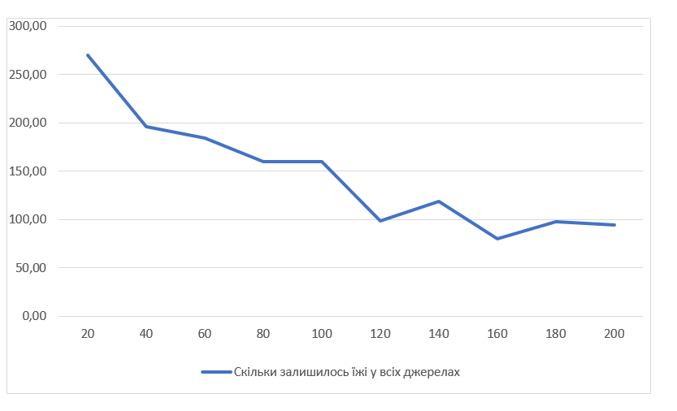
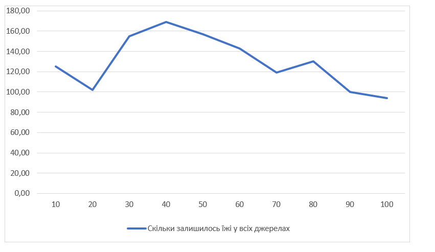
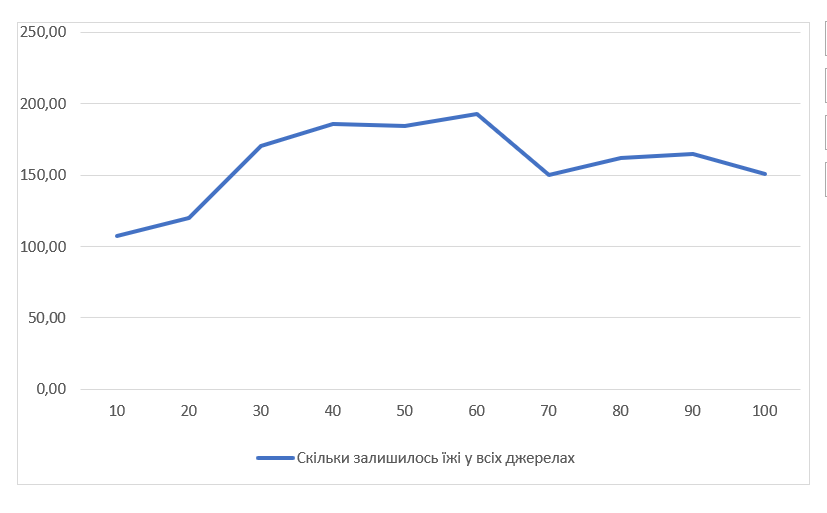

## Комп'ютерні системи імітаційного моделювання
## СПм-22-4, **Івановський Петро**
### Лабораторна робота №**1**. Опис імітаційних моделей та проведення обчислювальних експериментів

### Варіант 10, модель у середовищі NetLogo:
[Ants](https://www.netlogoweb.org/launch#http://www.netlogoweb.org/assets/modelslib/Sample%20Models/Biology/Ants.nlogo)

### Вербальний опис моделі:
Модель, що імітує колонію мурах для ефективного збору їжі. Кожна мураха, яка знаходить припаси, керується за рядом простих правил, щоб забезпечити спільну дію колонії. Під час транспортування їжі до гнізда, мурахи використовують феромони, для залишення сліду. Коли інші мурахи реагують на цей хімічний слід, вони слідують за феромоном та, в ідеалі, приєднуються до збору їжі.

### Керуючі параметри:
- **population** - визначає кількість мурах у колонії. Значення від 0 до 200.
- **diffusion-rate** - визначає швидкість та силу розповсюдження феромонів в середовищі. Значення від 0 до 99.
- **evaporation-rate** - визначає швидкість випаровування феромонів з середовища. Значення від 0 до 99

### Внутрішні параметри:
- **chemical** - кількість феромону на патчі. Чим більше, тим зеленіший і світліший патч.
- **food** - кількість їжі на даному патчі(0, 1 або 2). Визначається випадково для джерел їжі.
- **nest?** - визначає для патча, чи є він частиною гнізда. True на ділянках гнізда, false в інших місцях.
- **nest-scent** - число, яке збільшується ближче до гнізда. Допомагає мурахам знайти гніздо по "запаху".
- **food-source-number** - номер (1, 2 або 3), який ідентифікує джерела їжі. У кожного джерела свій номер.

### Показники роботи системи:
Графік, який відображає, скільки залишилось їжі у кожному з джерел їжі.

### Примітки:
- Колонія мурашок зазвичай використовує джерело їжі по порядку, починаючи з їжі, яка знаходиться найближче до гнізда, і закінчуючи їжею, що знаходиться найдалі від гнізда.
- Кольори ліній на графіку збігаються з кольорами куп їжі.
- Коли мурахи закінчують збирати джерело їжі, то все одно продовжують крутитись навколо нього якийсь час, поки феромон не випарується.
  
### Недоліки моделі:  
- Кількість джерел їжі, або кількість їжі у джерелах неможливо вручну налаштувати. Хоча, це можна зробити через код моделі, але це не зручно.
- Мурахи безсмертні і їх кількість не змінюється з часом. Це зовсім не як у реальному житті хоча це важливий аспект.
- У моделі представлена лише одна колонія мурах. Хоча в природі колонії мурах часто конкурують за запаси їжі.

## Обчислювальні експерименти
### 1. Вплив розміру популяції мурах на збір їжі
Досліджується залежність швидкості збору їжі від розміру популяції мурах в колонії. Довжина кожної симуляції 400 тактів.
Експерименти проводяться при 20-200 мурашках, з кроком 20, усього 10 симуляцій. 

Інші керуючі параметри мають значення за замовчуванням:
- **diffusion-rate**: 50
- **evaporation-rate**: 10
  
На початку кожної симуляції у всіх джерелах сумарно їжі приблизно 300.
<table>
<thead>
<tr><th>Кількість мурах</th><th>Скільки залишилось їжі у всіх джерелах</tr>
</thead>
<tbody>
<tr><td>20</td><td>270</td></tr>
<tr><td>40</td><td>196</td></tr>
<tr><td>60</td><td>184</td></tr>
<tr><td>80</td><td>160</td></tr>
<tr><td>100</td><td>160</td></tr>
<tr><td>120</td><td>99</td></tr>
<tr><td>140</td><td>119</td></tr>
<tr><td>160</td><td>80</td></tr>
<tr><td>180</td><td>98</td></tr>
<tr><td>200</td><td>94</td></tr>
</tbody>
</table>

Графік наочно показує, що із збільшенням кількості мурах у колонії спостерігається тенденція до зменшення кількості їжі у всіх джерелах, що абсолютно логічно. Чим більше мурах, тим швидше вони знаходять і збирають їжу і тим стійкіші феромонні шляхи вони утворюють.

### 2. Вплив дифузії феромонів на збір їжі
Досліджується залежність швидкості збору їжі від дифузії феромонів. Довжина кожної симуляції 400 тактів.
Експерименти проводяться при 10-100 значення дифузії, з кроком 10, усього 10 симуляцій.  

Інші керуючі параметри мають значення за замовчуванням:
- **population**: 125
- **evaporation-rate**: 10

На початку кожної симуляції у всіх джерелах сумарно їжі приблизно 300.
<table>
<thead>
<tr><th>Дифузія</th><th>Скільки залишилось їжі у всіх джерелах</tr>
</thead>
<tbody>
<tr><td>10</td><td>125</td></tr>
<tr><td>20</td><td>102</td></tr>
<tr><td>30</td><td>155</td></tr>
<tr><td>40</td><td>169</td></tr>
<tr><td>50</td><td>157</td></tr>
<tr><td>60</td><td>143</td></tr>
<tr><td>70</td><td>119</td></tr>
<tr><td>80</td><td>130</td></tr>
<tr><td>90</td><td>100</td></tr>
<tr><td>100</td><td>155</td></tr>
</tbody>
</table>

Графік наочно показує, що існує залежність між рівнем дифузії феромонів та швидкістю збору їжі. З результатів можна виокремити тенденцію до зменшення залишеної їжі у всіх джерелах зі збільшенням значень дифузії. Це може вказувати на те, що високий рівень дифузії поліпшує комунікацію між мурахами, сприяючи ефективнішому використанню ресурсів.

### 3. Вплив випаровування феромонів на збір їжі
Досліджується залежність швидкості збору їжі від  швидкості випаровування феромонів з середовища. Довжина кожної симуляції 400 тактів.
Експерименти проводяться при 10-100 значеннях випаровування, з кроком 10, усього 10 симуляцій.

Інші керуючі параметри мають значення за замовчуванням:
- **population**: 125
- **diffusion-rate**: 50
  
На початку кожної симуляції у всіх джерелах сумарно їжі приблизно 300.
<table>
<thead>
<tr><th>Випаровування</th><th>Скільки залишилось їжі у всіх джерелах</tr>
</thead>
<tbody>
<tr><td>10</td><td>103</td></tr>
<tr><td>20</td><td>120</td></tr>
<tr><td>30</td><td>170</td></tr>
<tr><td>40</td><td>186</td></tr>
<tr><td>50</td><td>184</td></tr>
<tr><td>60</td><td>193</td></tr>
<tr><td>70</td><td>150</td></tr>
<tr><td>80</td><td>162</td></tr>
<tr><td>90</td><td>165</td></tr>
<tr><td>100</td><td>151</td></tr>
</tbody>
</table>

З результатів видно, що при збільшенні швидкості випаровування залишається більше їжі у всіх джерелах. Це може бути пов'язано з тим, що менший час випаровування дозволяє феромонам залишатися довше та краще вказувати шляхи для збору їжі. 
