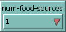
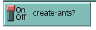
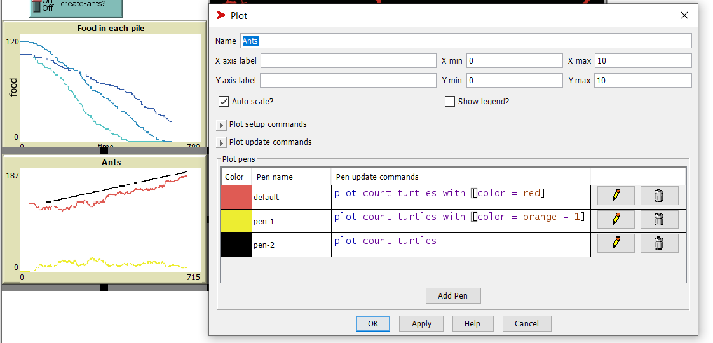
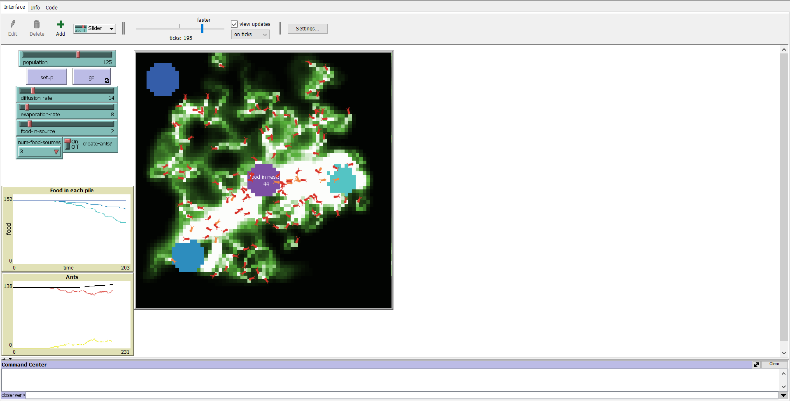
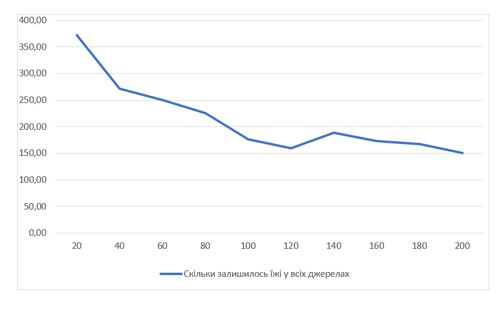

## Комп'ютерні системи імітаційного моделювання
## СПм-22-4, **Івановський Петро**
### Лабораторна робота №**2**. Редагування імітаційних моделей у середовищі NetLogo

### Варіант 10, модель у середовищі NetLogo:
[Ants](https://www.netlogoweb.org/launch#http://www.netlogoweb.org/assets/modelslib/Sample%20Models/Biology/Ants.nlogo)

 

### Внесені зміни у вихідну логіку моделі, за варіантом:

**Додано можливість вказувати кількість джерел їжі на полі** 

Змінено процедуру setup-food. Деякі джерела їжі не будуть створені, якщо на селекторі замале значення.
<pre>
 to setup-food  ;; patch procedure
  ;; setup food source one on the right
  if (distancexy (0.6 * max-pxcor) 0) < 5 and num-food > 0
  [ set food-source-number 1 ]
  ;; setup food source two on the lower-left
  if (distancexy (-0.6 * max-pxcor) (-0.6 * max-pycor)) < 5 and num-food > 1
  [ set food-source-number 2 ]
  ;; setup food source three on the upper-left
  if (distancexy (-0.8 * max-pxcor) (0.8 * max-pycor)) < 5 and num-food > 2
  [ set food-source-number 3 ]
  ;; set "food" at sources to either 1 or 2, randomly
  if food-source-number > 0
  [ set food one-of [1 2] ]
end
</pre>

Доданий відповідний селектор:

                  
**Додано показник кількості зібраної їжі у гнізді, що відображається користувачеві:**

Створено змінну, яка відповідає за підрахунок принесеної у гніздо їжі:
<pre>
  collected-food
 </pre>

Змінено процедуру go. На гнізді відображається лічільник їжі:
<pre>
to go  ;; forever button
  ...
  ask patch 4 1 [set plabel "food in nest:"] 
  ask patch 1 -1 [set plabel collected-food]
  ...
end
</pre>

Змінено процедуру return-to-nest. Якщо мураха несла їжу і повернулась у гніздо, то лічильник їжі збільшується на одиницю:
 <pre>
to return-to-nest  ;; turtle procedure
  ifelse nest?
  [ 
   ...
    set collected-food collected-food + 1
    rt 180 ]
   ...
end
</pre>

**Додано відключаєму можливість появи нових мурах за умов наявності достатньої кількості їжі у гнізді**

Змінено процедуру go. Якщо зібраної їжі більше 10, то кожні 10 тіків може бути створена нова мураха. Створення мурахи коштує 1 одиницю їжі.
<pre>
to go  ;; forever button
  ...
  if collected-food > 10 and ticks mod 20 = 0 and count turtles < 200 and create-ants?[
   set collected-food collected-food - 1
   create-turtles 1
  [ set size 2         ;; easier to see
    set color red  ]
  ]
...
end
</pre>

Перемикач можливості створення мурах:

**Додати графік зміни кількості мурах.**

Створено графік кількості мурах:
- Чорний - всього мурах.
- Червоний - мурахи, які шукають їжу
- Жовтий - мурахи, які знайшли їжу і несуть її в гніздо

### Внесені зміни у вихідну логіку моделі, на власний розсуд:

**Феромони**
В реальному житті мурахи весь час виділяють феромони, хоч вони знайшли їжу, хоч не знайшли. Тому було змінено процедуру look-for-food. Тепер, коли мурахи ще не знайшли їжу, вони все одно виділяють невелику кількість феромону. В 15 разів менше ніж коли вони знайшли їжу. З однієї сторони, це робить рух мурах куди кращим, адже мурахи слідують одна за одною і держуться групи, де б вони не були. З іншої, це зменшує ефективність збирання їжі, хоча це і більш реалістично.
<pre>
 to look-for-food  ;; turtle procedure
  if food > 0
  [ set color orange + 1     ;; pick up food
    set food food - 1        ;; and reduce the food source
    rt 180                   ;; and turn around
    stop ]
  ;; go in the direction where the chemical smell is strongest
  if (chemical >= 0.05) and (chemical < 2)
  [ uphill-chemical ]
  set chemical chemical + 4
end
</pre>

**Кількість їжі в джерелах їжі**
В оригіналі на кожному патчі з їжею випадково визначалось, скільки одиниць їжі на цьому патчі. Це кожного разу вносило деякі невизначеність у моделюванні і випадковість. Тому було додано слайдер, який точно визначає, скільки буде одиниць їжі у патчах з їжею. Для цього змінено процедуру setup-food:
<pre>
to setup-food  ;; patch procedure
  ;; setup food source one on the right
  if (distancexy (0.6 * max-pxcor) 0) < 5 and num-food-sources > 0
  [ set food-source-number 1 ]
  ;; setup food source two on the lower-left
  if (distancexy (-0.6 * max-pxcor) (-0.6 * max-pycor)) < 5 and num-food-sources > 1
  [ set food-source-number 2 ]
  ;; setup food source three on the upper-left
  if (distancexy (-0.8 * max-pxcor) (0.8 * max-pycor)) < 5 and num-food-sources > 2
  [ set food-source-number 3 ]
  ;; set "food" at sources to either 1 or 2, randomly
  if food-source-number > 0
  [ set food food-in-source ]
end
</pre>

Фінальний код моделі та її інтерфейс доступні за [посиланням](Ants_v2.nlogo). 
 

## Обчислювальні експерименти
### 1. Вплив розміру популяції мурах на збір їжі
Досліджується залежність швидкості збору їжі від розміру популяції мурах в колонії. Довжина кожної симуляції 400 тактів.
Експерименти проводяться при 20-200 мурах, з кроком 20, усього 10 симуляцій. 

Інші керуючі параметри мають значення за замовчуванням:
- **diffusion-rate**: 50
- **evaporation-rate**: 10
- **food-in-source**:2
- **num-food-sources**:3
- **create-ants?**:on
  
На початку кожної симуляції у всіх джерелах сумарно їжі рівно 414.
<table>
<thead>
<tr><th>Кількість мурах</th><th>Скільки залишилось їжі у всіх джерелах</tr>
</thead>
<tbody>
<tr><td>20</td><td>372</td></tr>
<tr><td>40</td><td>271</td></tr>
<tr><td>60</td><td>250</td></tr>
<tr><td>80</td><td>225</td></tr>
<tr><td>100</td><td>176</td></tr>
<tr><td>120</td><td>160</td></tr>
<tr><td>140</td><td>188</td></tr>
<tr><td>160</td><td>173</td></tr>
<tr><td>180</td><td>167</td></tr>
<tr><td>200</td><td>151</td></tr>
</tbody>
</table>

З результатів видно, що із збільшенням кількості мурах у колонії зменшується кількість залишеної їжі у всіх джерелах. Це може вказувати на те, що більша кількість мурах призводить до більш ефективного використання ресурсів та швидшого збору їжі. Але починаючи з 100 початкових мурах, збільшення їх кількості не призводить до сильних покращень результатів, тому що модель обмежена 200 мурах в симуляції і їх розмноження не так сильно збільшує ефективність.
